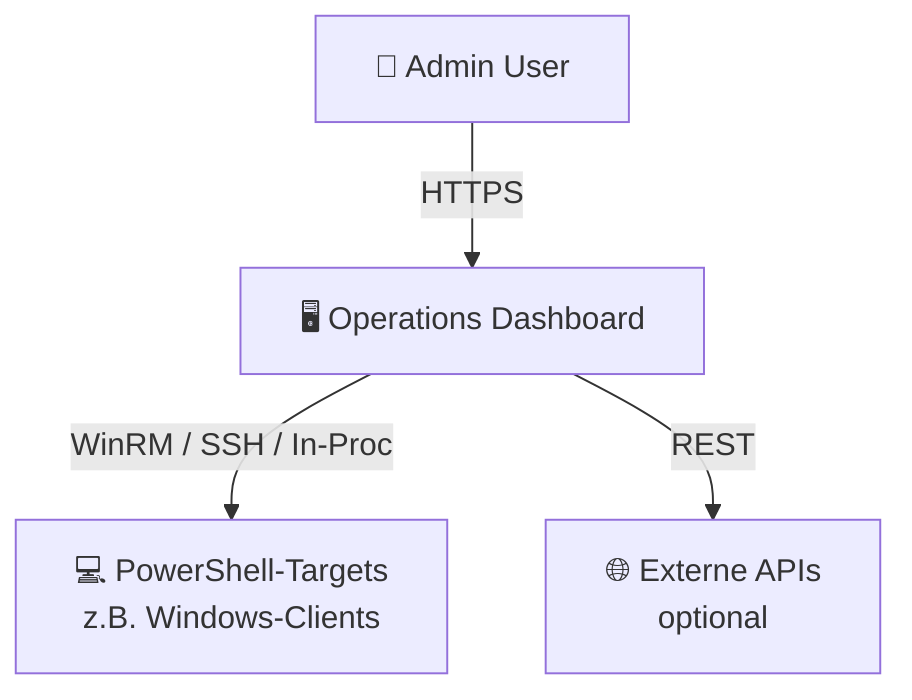
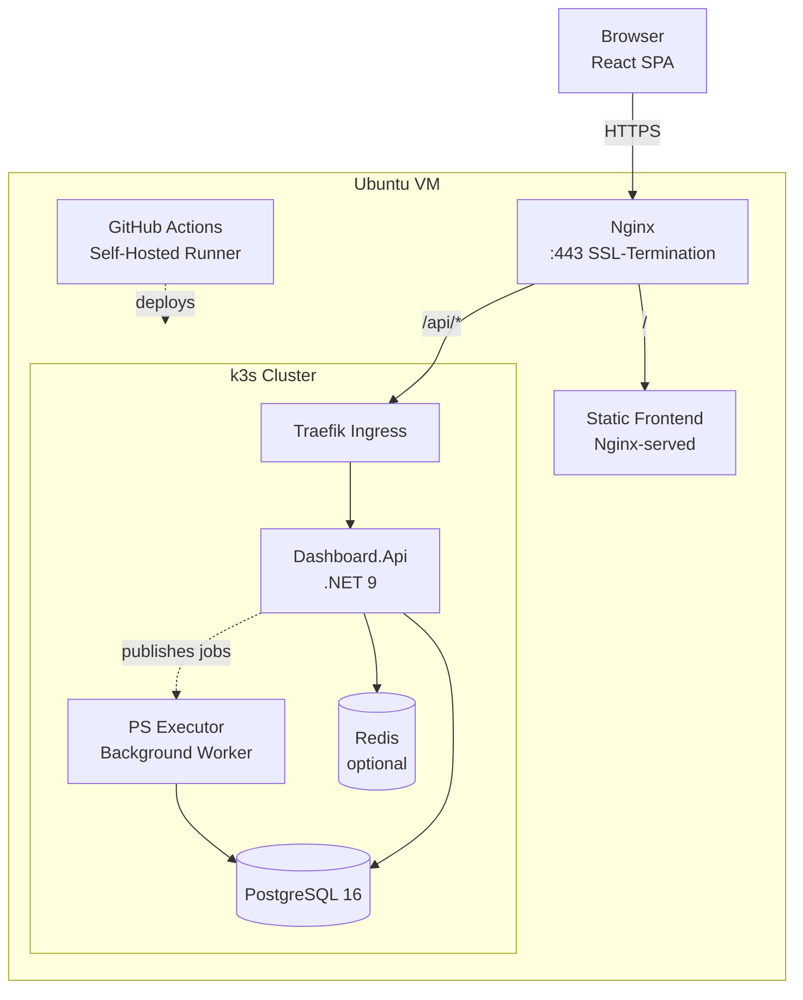
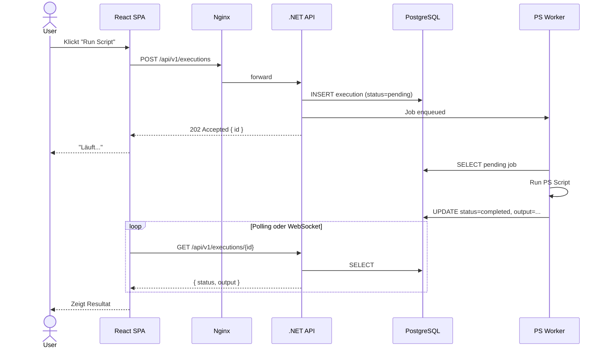

# 02 — Architecture

## 1. System Context (C4 Level 1)



---

## 2. Container Diagram (C4 Level 2)



---

## 3. Komponenten-Beschreibung

### 3.1 Frontend (React SPA)

- **Build:** Vite → statische Assets in `dist/`
- **Serving:** Nginx liefert `index.html` + Assets aus (kein Node.js im Prod nötig)
- **Routing:** Client-side (React Router) + Nginx `try_files` für SPA-Fallback
- **API-Calls:** `VITE_API_BASE_URL` → `/api` (same-origin, kein CORS nötig)
- **Auth-Flow:** JWT in HttpOnly-Cookie (sicherer als LocalStorage)

### 3.2 Backend API (.NET 9)

- **Projekt-Struktur:**
  ```
  backend/
  ├── Dashboard.Api/                 → Controller, Middleware, Program.cs
  ├── Dashboard.Core/                → Entities, Interfaces, Business Logic
  ├── Dashboard.Infrastructure/      → EF Core, Repositories, DbContext
  ├── Dashboard.PowerShell/          → PS Executor, Runspaces
  └── Dashboard.Tests/               → xUnit
  ```
- **Clean Architecture:** Api → Core ← Infrastructure (Core hat keine Aussenabhängigkeiten)
- **Endpoints:** REST, versioniert (`/api/v1/...`)
- **Dokumentation:** Swagger/OpenAPI unter `/api/swagger`

### 3.3 PowerShell Executor

- **Zwei Varianten, je nach Use-Case:**

  **Variante A — In-Process (Default):**
  - `System.Management.Automation.Runspaces` innerhalb der API
  - Scripts werden aus `powershell/scripts/*.ps1` geladen
  - Output als strukturierte Objekte zurück an API
  - **Vorteil:** Einfach, typisiert
  - **Nachteil:** Blockiert API-Threads bei langen Scripts

  **Variante B — Background-Worker (Empfohlen ab Phase 3):**
  - Separater Container `Dashboard.PowerShell.Worker`
  - Job-Queue in PostgreSQL (oder Redis Streams)
  - API pusht Jobs, Worker konsumiert
  - **Vorteil:** Skalierbar, API bleibt responsive
  - **Nachteil:** Mehr Infra

### 3.4 Datenbank (PostgreSQL)

- **Schema-Migrations:** EF Core Migrations
- **Connection-Pool:** Npgsql-Default (max. 100)
- **Backup:** tägliches `pg_dump` via CronJob im Cluster
- **Tabellen (initial):**
  - `users` — Auth
  - `ps_scripts` — Metadata über verfügbare PS-Scripts
  - `ps_executions` — Ausführungs-Log mit Input/Output
  - `metrics` — Zeitreihen-Daten für Charts
  - `audit_log` — Wer hat was wann gemacht

### 3.5 Nginx

- **Aufgaben:**
  1. SSL-Termination (Let's Encrypt)
  2. Static-File-Serving fürs Frontend
  3. Reverse-Proxy `/api/*` → k3s Ingress (z.B. `localhost:8080`)
  4. HTTP → HTTPS Redirect
  5. Security-Headers (HSTS, CSP, X-Frame-Options)

### 3.6 k3s Cluster

- **Namespaces:** `dashboard-dev`, `dashboard-prod`
- **Ingress:** Traefik (k3s-Default) oder Nginx-Ingress-Controller
- **Secrets:** via `kubectl create secret` (oder Sealed Secrets später)
- **Storage:** `local-path` StorageClass (k3s-Default)

---

## 4. Request-Flow (Beispiel: PS-Script ausführen)



---

## 5. API-Design (REST)

### Konventionen
- Basis: `/api/v1/`
- Plural-Resources: `/scripts`, `/executions`, `/users`
- Verb-Endpoints nur für Aktionen: `/executions/{id}/cancel`
- Response-Format: JSON, camelCase
- Errors: RFC 7807 (Problem Details)
- Pagination: `?page=1&pageSize=20`, Response-Header `X-Total-Count`

### Core-Endpoints (MVP)

| Method | Path | Zweck |
|--------|------|-------|
| `POST` | `/api/v1/auth/login` | JWT erhalten |
| `POST` | `/api/v1/auth/refresh` | Token refresh |
| `GET`  | `/api/v1/scripts` | Liste verfügbarer PS-Scripts |
| `GET`  | `/api/v1/scripts/{id}` | Details |
| `POST` | `/api/v1/executions` | Script starten |
| `GET`  | `/api/v1/executions` | Liste (mit Filter) |
| `GET`  | `/api/v1/executions/{id}` | Details + Output |
| `POST` | `/api/v1/executions/{id}/cancel` | Abbrechen |
| `GET`  | `/api/v1/metrics/summary` | Dashboard-Kennzahlen |
| `GET`  | `/api/v1/metrics/timeseries?type=...` | Chart-Daten |

---

## 6. Security-Architektur

| Schicht | Massnahme |
|---------|-----------|
| **Transport** | TLS 1.3, HSTS, HTTP → HTTPS Redirect |
| **AuthN** | JWT (HS256 MVP → RS256 später), Access (15 min) + Refresh (7 d) |
| **AuthZ** | Role-Based (Admin / Operator / Viewer) via `[Authorize(Roles=)]` |
| **Input** | FluentValidation, Zod im Frontend, EF Core (parameterisierte Queries) |
| **PS-Execution** | Whitelisted Scripts (keine User-Uploads), Input-Sanitization, Timeout |
| **Secrets** | k8s Secrets, NIE im Image/Repo |
| **CORS** | Same-Origin (Nginx löst's), falls nötig: Whitelist |
| **Rate-Limiting** | ASP.NET Core Rate-Limiting Middleware |
| **Audit** | Alle State-Changes im `audit_log` |

---

## 7. Wichtige Architektur-Entscheide (ADRs)

### ADR-001: PostgreSQL statt SQL Server
- **Kontext:** .NET wird oft mit SQL Server gepaart
- **Entscheid:** PostgreSQL
- **Begründung:** Kostenlos (SQL Server Express hat harte Limits), besseres k8s-Support, pgvector für spätere ML-Features

### ADR-002: k3s statt Docker Compose
- **Kontext:** Single-VM-Deployment
- **Entscheid:** k3s
- **Begründung:** Production-Patterns (Deployments, Services, Ingress), einfacher Weg zu Multi-Node später, selbe Manifests lokal (k3d) + prod

### ADR-003: In-Process PowerShell zuerst, Worker später
- **Kontext:** Komplexität vs. Skalierung
- **Entscheid:** Start mit In-Process, Migration zu Worker ab Phase 3
- **Begründung:** Schnellerer MVP, Worker-Pattern ist später additiv einbaubar

### ADR-004: shadcn/ui statt Material UI / Chakra
- **Kontext:** UI-Komponenten-Library
- **Entscheid:** shadcn/ui
- **Begründung:** Code-Ownership (kein Lib-Lock-in), Tailwind-nativ, moderne Aesthetik, Radix = a11y-ready
